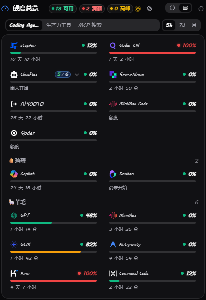
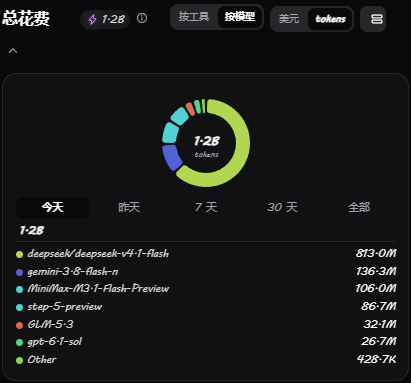
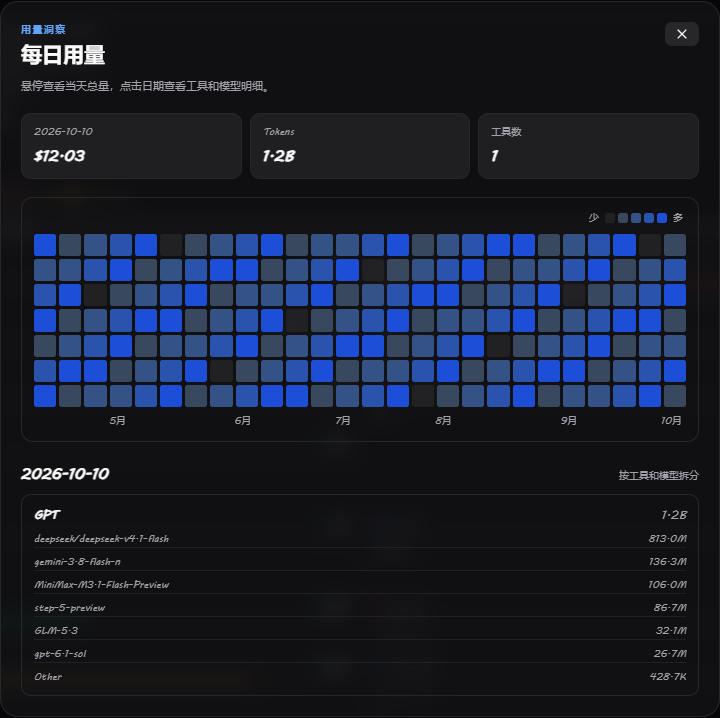

<div align="center">


# Pane

### 常驻托盘的本地用量与额度工作台

**Usage, quotas, balances and resets — one desktop workspace.**

[](https://github.com/Aafff623/pane/releases)
[-0078D4.svg?style=flat-square&logo=windows)](https://github.com/Aafff623/pane/releases)
[](https://tauri.app/)
[](src-tauri/Cargo.toml)
[](package.json)
[](vite.config.ts)
[](docs/providers.md)
[](parse-tests/)
[](LICENSE)
[](#i18n)
[](docs/privacy.md)

<br/>

**[简体中文](README.md)** • **[English](README_EN.md)**

[官网](https://pane.threetwoa.live/) • [英文官网](https://pane.threetwoa.live/en/) • [GitHub](https://github.com/Aafff623/pane)

<br/>

[📖 简介](#intro) • [🎬 在线演示](#demo) • [🌟 功能概览](#highlights) • [✨ 功能特性](#features) • [🔌 支持的来源](#providers) • [🚀 快速开始](#download) • [🛠️ 本地构建](#build) • [📂 项目结构](#structure) • [🔐 隐私边界](#privacy) • [📋 更新日志](CHANGELOG.md)

</div>

---

## <a id="intro"></a>📖 简介

**Pane** 是一个本地优先的**用量与额度工作台**。它把不同工具与在线服务的**用量、剩余额度、余额、重置时间和账户状态**，收进一个随时可唤出的桌面面板，方便集中查看和管理。

当前目录收录 **66 个来源**，覆盖 AI 编程与模型服务、语音等生产力工具，以及搜索、爬虫与 MCP 服务；支持的本地 CLI 还可汇总 **Token 与花费**。各来源能读取哪些指标，取决于对应接口或本地数据。

后续接入方向围绕「可查询的用量与资源」展开：自动化与工作流、办公与商业 SaaS、云算力与数据库、网盘与存储、网络流量和数字会员等，都可以作为扩展候选。具备可读取的用量、额度、余额或有效期数据，是评估接入的基础；具体仍需核实访问权限并适配接口与计量口径。这些方向不代表目前已支持。

用 `Alt + 2` 在任何窗口之上唤出面板，`Shift` 在同一张总览里切换 **5 小时 / 7 天 / 每月**周期，`Esc` 收起回到当前工作。不打断工作流，只在你需要的时候给出准确上下文。

> 💡 **设计重点**：
> - **本地优先**：token、cookie、API key 保存在本机系统凭据库与用户目录，不上传、不经过 Pane 的中转后端；查询请求直达对应厂商端点；
> - **一个桌面层**：额度查询、重置倒计时、多账号池、总花费与密钥管理都集中在一个面板，设置是独立窗口而非网页后台；
> - **常驻不打扰**：托盘常驻，默认每 5 分钟自动刷新一次（可调），失败会如实显示为错误状态而不是灰掉的未知额度。

## <a id="demo"></a>🎬 在线演示

不想先安装？官网内置了**真实前端打包驱动**的交互演示——`Alt + 2`、`Shift`、`Ctrl + S` 等 9 个快捷键、深浅主题切换和移动端布局都能直接试。演示数据固定，不连接真实账户；桌面版支持全局快捷键。

<div align="center">

[](https://pane.threetwoa.live)

</div>

## <a id="highlights"></a>🌟 功能概览

Pane 把「现在还剩多少、什么时候重置、哪个账号快到上限、今天花了多少」压缩成一个安静的托盘工具。面板默认只展示最重要的状态，细节在需要时展开。

| 功能方向 | 当前能力 |
| :--- | :--- |
| **额度总览** | 5 小时 / 7 天 / 每月周期切换、绿黄红状态、重置倒计时、失败即报错 |
| **本地花费** | 读本地 CLI 日志回看 Token 与美元花费，按模型拆分明细与分档图标 |
| **多账号池** | 同一服务商挂多个账号、独立出卡、两级备注、设为默认与归档 |
| **分类与分组** | Coding Agent / 生产力工具 / MCP 搜索标签、可自定义批注、抽屉内搜索 |
| **密钥管理** | 系统凭据库存储、主密码验证后查看明文、本机登录态识别 |
| **快捷键体系** | 9 组内置快捷键、全行冲突检测、逐键重录与一键还原 |
| **主题与外观** | 深浅主题、开机品牌动画、实验性皮肤市场（默认隐藏） |
| **服务商接入** | 66 家服务商，本地登录 / OAuth / API key 三种读取形态 |

> 📋 更完整的版本变化请查看 [CHANGELOG.md](CHANGELOG.md)。

---

## <a id="features"></a>✨ 功能特性

### 1. 📊 额度，一处看清

- 会话（5 小时）、周度（7 天）与月度额度汇集到同一张总览，用 `Shift` 直接切换周期；
- 用绿色、黄色、红色状态快速区分可用、高峰和额度不可用；
- 查询失败会明确显示为错误状态，不再伪装成灰色的未知额度；
- 没有月额度的服务商在月视图会回退到周额度，并明确标注回退状态。

<div align="center">
  
  <br/><sub>当前前端静态截图，使用示例数据，不连接真实账户。</sub>
</div>

---

### 2. 🧾 花费，有迹可循

- 读取支持的本地 CLI 日志，计算今日、昨日和近 30 天消费，不经过任何云端服务；
- 支持美元与 token 双视图，按模型展开明细；
- 当模型价格未知时保留 token 事实，并明确标注未计价项；
- 花费卡图标按日 token 量分档渐变，阈值可在设置中自定义；
- 各 CLI 的计量方式与覆盖范围见 [Token 花费覆盖](docs/token-spend-coverage.md)。

<div align="center">
  
  <br/><br/>
  
  <br/><sub>花费与热力图使用示例数据；暂用静态图片，后续可替换为 GIF。</sub>
</div>

---

### 3. ⏱️ 重置，不再猜测

- 每个窗口显示剩余额度与恢复时间倒计时；
- **长墙镜像**：周/月额度打满时，短周期环直接镜像墙状态（100% + 刷新倒计时），消除「5 小时环还是绿的但请求全被拒」的假象（首期覆盖 Kimi，其余家族逐家实测后扩展）；
- 额度耗尽时给出可读解释（如 `Weekly limit reached · resets in Xd Yh`），而不是一个空详情的裸红环。

---

### 4. 🧩 账号池，一个服务商多个账号

- API key 类服务商可以在设置中保存多个账号，各自独立出卡；
- 每个账号拥有稳定的本地卡片身份，删除或重排不会串号；
- 备注分两级：「Provider 名称」只改卡片标题，「子账号名称」只改该账号；
- 右键账号胶囊可设为默认主账号、归档或恢复（凭据随档）；
- 总览默认收起为「主账号环 + 用量条 + N/M 徽章」，点击展开。

---

### 5. 🗂️ 分类、批注与卡片分组

- 标签栏按 **Coding Agent / 生产力工具 / MCP 搜索**分类切换；
- 批注可自定义，按自己的工作流组织看板；
- Customize 抽屉顶部搜索框按名称就地过滤，分组头随空隐藏；
- 每个 provider 都可以从看板移除，底部「已删除的 Provider」随时可恢复。

---

### 6. ⌨️ 快捷键，随叫随到

| 快捷键 | 作用 |
| :--- | :--- |
| `Alt + 2` | 快速唤醒 / 收起悬浮面板（默认，可自定义） |
| `Esc` | 收起面板，回到当前工作 |
| `Shift` | 依次切换 5 小时 / 7 天 / 每月额度周期 |
| `Shift + 1` | 切换分类标签 |
| `Ctrl + S` | 打开设置面板 |
| `Ctrl + E` | 打开自定义看板 |
| `Ctrl + L` | 切换深浅主题 |
| `Ctrl + R` | 立即刷新用量 |
| `T` | 查看临期清单 |

- 快捷键以键帽呈现，点击即录制、`Esc` 取消、`Backspace` 清除、`↺` 恢复内置默认；
- 冲突全行互查并红字提示，被系统占用时会保留上一次可用绑定。

---

### 7. 🔐 密钥，留在本机

- provider 主密钥与全部子账号密钥存入**系统凭据库**（Windows 凭据管理器等），JSON 文件不再明文落盘；
- 「密钥与额度」页每一行都需**主密码验证**才能查看明文，明文不上屏、可一键复制；
- 本机登录类（Copilot / Antigravity / Claude 等）行内显示绿色「已连接」并写明读取来源。

---

### 8. 🎨 主题与外观

- 深色 / 浅色主题一键切换，卡片入场与昼夜切换动画可关；
- 弹出主窗时播放开机品牌动画，可在设置中开关或重播，系统减动效时停格成片帧后正常退场；
- **皮肤市场为实验性功能，默认隐藏**，需在设置中二次确认后开启，关闭即热切回原生皮肤。

---

### 9. 🔌 服务商，按认证形态读取

- 目录收录 **66 家**服务商，首次安装默认启用 11 个主流家族（Claude、Codex、Cursor、Grok、Z.ai 等），其余在设置中按需开启；
- 三种读取形态：本地登录状态、OAuth 设备流、API key；
- 卡片菜单「⚡ 测试连通性」对未启用的卡也可测，状态栏显示 `连通正常 · N ms` 或失败原因；
- 「? 额度查询说明」按认证形态自动给出 key / OAuth / 本地三种步骤模板与控制台直链。

---

### 10. 🔄 托盘与更新

- 托盘右键直出各 provider 状态行（读本地快照，零网络请求）与设置入口；
- 检测到新版本时总花费横栏出现轻量 ↑ 指示器，不弹窗打断；点击即原地下载，圆环按真实字节进度填充，完成后自动安装并重启。

---

## <a id="providers"></a>🔌 支持的来源

Pane 当前覆盖 66 个服务商。下面列出最常用的几类，完整说明见 [Provider catalog](docs/providers.md)。

这里的 66 是当前源码目录的数量；已发布安装包支持的来源以对应版本为准。各来源可读取的额度、余额或本地花费范围不同。

| 类型 | 来源 | 读取方式 |
| --- | --- | --- |
| 订阅额度 | Claude、Codex、Cursor、GitHub Copilot | 本地登录状态 + 官方 usage API |
| API key 额度 | DeepSeek、Kimi Code、StepFun、SiliconFlow、Novita | 设置中的 key、环境变量或 CLI 配置 |
| 多账号池 | ClinePass、One/New API、Custom Relay 等 | `accounts/<provider>.json` 中的独立账号 |
| 本地消费 | OpenCode、Claude Code、Codex CLI、Hermes 等 | 本地数据库或 CLI 日志 |
| 本地服务 | Ollama | `127.0.0.1:11434` 模型与服务状态 |

ClinePass 使用 `sk_` key 查询五小时、周、月三个滚动窗口；同一 provider 下的多个 key 会分别显示，并在卡片附近提示账号数量。

<details>
<summary><b>全部 66 个服务商一览</b>（点击展开，与 <code>src/providerCatalog.ts</code> 一致）</summary>

Claude、Codex、CodeBuddy、Cursor、OpenCode、Copilot、Grok、Devin、MiniMax、OpenRouter、Z.ai、Antigravity、DeepSeek、Kimi API、ElevenLabs、Ollama、Codebuff、Kilo、AihubMix、One/New API、Qwen Code、Hermes、Kimi Code、StepFun、StepFun Step Plan、闪电说、SiliconFlow、Novita AI、Custom Relay、Qoder CN、Trae CN、Command Code、Doubao、ClawsGO、BochaAI、Tavily、Firecrawl、Brave Search、ClinePass、SenseNova、APIGOTO、MiniMax Code、Amp、AWS Bedrock、Chutes、Deepgram、Kiro、OpenAI API、Poe、Venice、Vertex AI、Warp、Windsurf、MiMo、Trae、Qoder、Zed、Droid、JetBrains AI、Groq、Hugging Face、LongCat、sub2api、Mistral、Perplexity、Volcengine Ark

</details>

---

## <a id="download"></a>🚀 快速开始与下载

### 当前主线版本：`0.5.0`

| 平台 | 安装包 | 状态 | 下载入口 |
| :--- | :--- | :--- | :--- |
| **Windows 10 / 11 (x64)** | `*-setup.exe`（NSIS 安装器） | 🟢 主要开发与验证平台 | [⬇️ 下载最新版](https://github.com/Aafff623/pane/releases/latest) |
| **macOS** | `.dmg` | 🟡 随 Release 提供构建 | [⬇️ 前往下载](https://github.com/Aafff623/pane/releases) |
| **Linux** | `.AppImage` / `.deb` | 🟡 随 Release 提供构建 | [⬇️ 前往下载](https://github.com/Aafff623/pane/releases) |
| **历史版本归档** | 全部历史产物 | 📂 版本回溯与对比 | [📂 浏览 Releases 归档](https://github.com/Aafff623/pane/releases) |

### 基础使用流程：

1. 从 [Releases](https://github.com/Aafff623/pane/releases) 下载对应平台的安装包并启动，Pane 会进入系统托盘；
2. 按 `Alt + 2`（或点击托盘图标）唤出悬浮面板，面板出现在桌面正中央；
3. 打开设置（`Ctrl + S`），按各服务商的提示完成本地登录或粘贴 API key；未启用的卡片也可用「⚡ 测试连通性」先验证；
4. 用 `Shift` 切换 5 小时 / 7 天 / 每月周期，确认额度与重置时间；
5. `Esc` 收起面板，回到当前工作。

Pane 不需要单独注册账号。首次运行后，数据保存在当前用户的 `%APPDATA%\Pane\` 下。

### 从源码启动

```powershell
git clone https://github.com/Aafff623/pane.git
cd pane
pnpm install
pnpm dev
```

开发模式需要两个进程：Vite 在 `127.0.0.1:1420` 提供前端，`pane.exe` 在 `127.0.0.1:6736` 提供本地 usage API。完整的 Windows 启动和 WebView2 缓存说明见 [`docs/dev-startup.md`](docs/dev-startup.md)。

---

## <a id="i18n"></a>🌐 多语言支持 (Internationalization)

界面语言可在设置 → 常规中随时切换：

| 语言代码 | 显示名称 | 支持状态 |
| :--- | :--- | :---: |
| `zh` | 🇨🇳 简体中文 | 🟢 完整支持 |
| `en` | 🇺🇸 English | 🟢 完整支持 |
| `ru` | 🇷🇺 Русский | 🟢 完整支持 |
| `auto` | 🖥️ 跟随操作系统语言 | 🟢 完整支持 |

官网提供中文与英文入口：[`/`](https://pane.threetwoa.live/) 与 [`/en/`](https://pane.threetwoa.live/en/)。当前源码已支持双语，线上更新随官网部署生效。

---

## <a id="build"></a>🛠️ 本地构建与开发

### 环境要求

- Windows 10 / 11 (x64)
- [Node.js](https://nodejs.org/) 20+ 与 `pnpm`
- [Rust](https://rustup.rs/) stable 工具链
- WebView2 Runtime（Windows 10/11 通常已内置）

### 编译与运行

```powershell
# 1. 克隆代码仓库
git clone https://github.com/Aafff623/pane.git
cd pane

# 2. 安装前端依赖
pnpm install

# 3. 仅前端（TypeScript 检查 + Vite 构建）
pnpm build

# 4. 完整桌面应用（前端 + Rust）
pnpm tauri build
```

### Rust 侧检查

```powershell
cd src-tauri
$env:PATH = "D:\Tools\mingw64\bin;$env:PATH"
cargo +stable-x86_64-pc-windows-gnu check
```

### 运行 Provider 解析测试

`parse-tests` 通过 `#[path]` 直接编译 `src-tauri/src` 下的真实源码，另配一个 `tauri-stub` crate，因此无需链接完整 Tauri 应用即可运行：

```powershell
cd parse-tests
$env:PATH = "D:\Tools\mingw64\bin;$env:PATH"
cargo +stable-x86_64-pc-windows-gnu test
```

---

## <a id="structure"></a>📂 项目结构

```text
pane/
├── src/                             # 前端（TypeScript + Vite，无框架）
│   ├── main.ts                      # 看板渲染、刷新循环、设置、皮肤市场
│   ├── i18n.ts                      # 三语字典（zh / en / ru）
│   ├── providerCatalog.ts           # 前端 provider 能力目录
│   ├── providerVisuals.ts           # provider 图标、颜色与品牌视觉
│   ├── providerMechanisms.ts        # 各 provider 的读取机制说明文案
│   ├── peakHours.ts                 # 高峰时段判定
│   ├── uiIcons.ts                   # 界面图标
│   └── styles.css                   # 全部样式（含窄窗断点）
├── src-tauri/                       # 桌面端（Rust / Tauri v2）
│   ├── src/lib.rs                   # Tauri commands、快照缓存、账号交换保护
│   ├── src/providers/               # 各 provider 的额度查询适配器
│   ├── src/accounts.rs              # API key 账号池与稳定卡片身份
│   ├── src/keyvault.rs              # 主密钥与密钥库
│   ├── src/secretstore.rs           # 系统凭据库封装
│   ├── src/spend.rs / pricing.rs    # 本地 CLI 消费扫描与模型定价
│   ├── src/httpapi.rs               # 本地 API（127.0.0.1:6736/v1/usage）
│   ├── src/telemetry.rs             # 匿名遥测（可关闭）
│   ├── src/platform/                # OS 接缝（密钥、区域、进程、路径）
│   └── src/*_login.rs / oauth.rs    # 各家登录与 OAuth 设备流
├── parse-tests/                     # Provider 解析测试载体（编译真实源码）
├── site/                            # 官网（零框架单文件 + Cloudflare Worker）
├── docs/                            # 启动、隐私、provider 与设计文档
├── attachments/                     # README 截图素材
├── CHANGELOG.md                     # 完整版本更新日志
├── CONTRIBUTING.md                  # 贡献指南
└── LICENSE                          # MIT 许可证
```

---

## <a id="privacy"></a>🔐 隐私边界

Pane 是 local-first 工具：

- token、cookie 和 API key 保存在 Windows 用户目录与系统凭据库，不提交到 Git；
- 查询请求只发送到对应 provider 的端点；Pane 没有中心后端替你转发额度；
- 本地 HTTP API 只监听 loopback，并对敏感字段做脱敏处理；
- 遥测默认不承载额度、消费或 provider 凭据；可在设置中关闭。

详见 [`docs/privacy.md`](docs/privacy.md)；安全披露流程见 [`SECURITY.md`](SECURITY.md)。

---

## <a id="contributing"></a>🤝 参与贡献

欢迎提交 issue、provider 适配、UI 改进和文档修订。请在提交前说明：

1. 改动影响的 provider 或用户路径；
2. 使用了哪些本地数据或外部 API；
3. 如何验证，哪些部分仍需要手动验收。

新功能走 `codex/<feature>` 分支，验证通过后再合并回 `main`。详见 [`CONTRIBUTING.md`](CONTRIBUTING.md)。

### 相关文档

- [开发启动指南](docs/dev-startup.md) — Windows 双进程、缓存和 `pane.exe` 启动
- [Provider catalog](docs/providers.md) — provider 读取方式与字段说明
- [本地 HTTP API](docs/local-http-api.md) — `127.0.0.1:6736/v1/usage`
- [隐私说明](docs/privacy.md) — 凭据、网络请求和遥测边界
- [皮肤市场设计](docs/skin-market-design.md) — 壁纸、吉祥物和退出交互
- [CONTEXT.md](CONTEXT.md) — 已验证的领域事实与工程约束

---

## <a id="license"></a>📄 开源许可证

本项目采用 [MIT License](LICENSE) 授权。

Copyright (c) 2026 Jazii (Pane for Windows)
